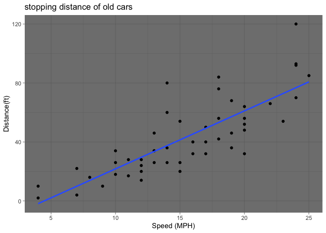
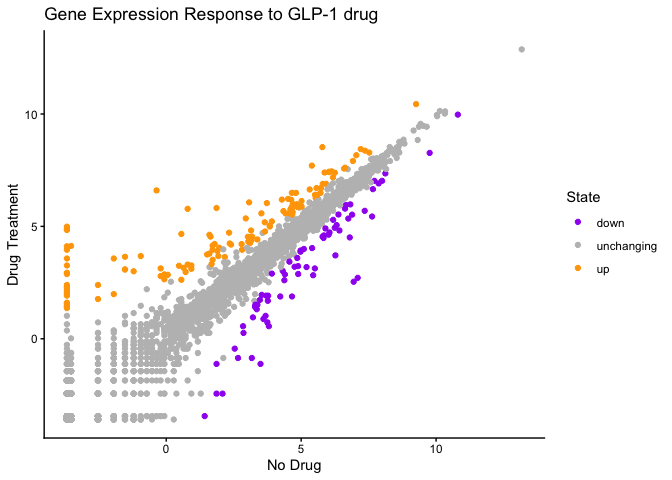
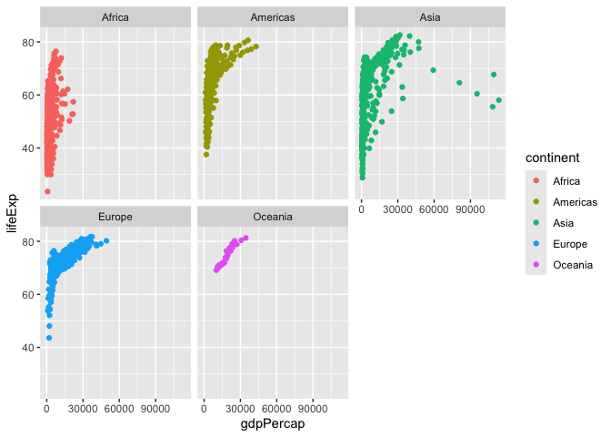

# Class 5: Data Viz with ggplot
Pooja Parthasarathy (PID:A17817456)

- [Background](#background)
- [Gene Expression Plot](#gene-expression-plot)
- [Going further with gapminder](#going-further-with-gapminder)
- [First look at the dplyr package](#first-look-at-the-dplyr-package)

## Background

There are lots of ways to make visualization and plots in R. These
include, so-called “base R” (like the function `plot()`) and **ggplot2**

Let’s make the same plot with these two graphics systems. We can use
inbuilt `cars` dataset.

``` r
head(cars)
```

      speed dist
    1     4    2
    2     4   10
    3     7    4
    4     7   22
    5     8   16
    6     9   10

``` r
plot(cars)
```


first you need to install ggplot using the command
`install.packages("ggplot2")`

> **N.B** We never run an install of packages in a code chunk otherwise
> we will reinstall needlesely every time we render our document

Everytime you want to use an add on packaged we need to load it up with
a call to `library()`

``` r
library(ggplot2)
ggplot(cars)
```


Every ggplot needs at least 3 things:

1.  The **Data** i.e. struff to plot as a dataframe
2.  **Aesthetics** that map the data to the plot
3.  **geom\_** or geometry of the plot

``` r
ggplot(cars) +
  aes(x=speed, y=dist) +
  geom_point() + 
  geom_smooth(method = "lm", se = FALSE) + 
  labs(x="Speed (MPH)", y= "Distance(ft)", title = "stopping distance of old cars") + 
  
  theme_dark()
```

    `geom_smooth()` using formula = 'y ~ x'



## Gene Expression Plot

Read some fata on the effects of GLP-1 inhibitor drug on gene expression
values

``` r
url <- "https://bioboot.github.io/bimm143_S20/class-material/up_down_expression.txt"
genes <- read.delim(url)
head(genes)
```

            Gene Condition1 Condition2      State
    1      A4GNT -3.6808610 -3.4401355 unchanging
    2       AAAS  4.5479580  4.3864126 unchanging
    3      AASDH  3.7190695  3.4787276 unchanging
    4       AATF  5.0784720  5.0151916 unchanging
    5       AATK  0.4711421  0.5598642 unchanging
    6 AB015752.4 -3.6808610 -3.5921390 unchanging

Version 1 plot - start simple by getting some ink on the page!

``` r
table(genes$State)
```


          down unchanging         up 
            72       4997        127 

``` r
ggplot(genes)+
  aes(Condition1,Condition2, col= State)+
  geom_point() + 
  scale_color_manual(values = c("purple","gray","orange")) +
  labs(x="No Drug", y= "Drug Treatment", title = "Gene Expression Response to GLP-1 drug") +
  theme_classic()
```



## Going further with gapminder

Here we explore the famous `gapminder` dataset with some custom plots

``` r
# File location online
url <- "https://raw.githubusercontent.com/jennybc/gapminder/master/inst/extdata/gapminder.tsv"

gapminder <- read.delim(url)
head(gapminder)
```

          country continent year lifeExp      pop gdpPercap
    1 Afghanistan      Asia 1952  28.801  8425333  779.4453
    2 Afghanistan      Asia 1957  30.332  9240934  820.8530
    3 Afghanistan      Asia 1962  31.997 10267083  853.1007
    4 Afghanistan      Asia 1967  34.020 11537966  836.1971
    5 Afghanistan      Asia 1972  36.088 13079460  739.9811
    6 Afghanistan      Asia 1977  38.438 14880372  786.1134

> Q. how many rows does this datasethave

``` r
nrow(gapminder)
```

    [1] 1704

> Q. how many different countries are in this dataset

``` r
table(gapminder$continent)
```


      Africa Americas     Asia   Europe  Oceania 
         624      300      396      360       24 

Version 1 plot GDP Vs Life Expectancy for all rows

``` r
ggplot(gapminder) +
  aes(x=gdpPercap, y=lifeExp, col=continent) + 
  geom_point() 
```


We want to see plots for each of the continents in ggplot lingo this is
called “faceting”

``` r
ggplot(gapminder) +
  aes(x=gdpPercap, y=lifeExp, col=continent) + 
  geom_point() +
  facet_wrap(~continent)
```



## First look at the dplyr package

Another add on package with a function called `filter` that we want to
use.

``` r
library(dplyr)
```


    Attaching package: 'dplyr'

    The following objects are masked from 'package:stats':

        filter, lag

    The following objects are masked from 'package:base':

        intersect, setdiff, setequal, union

``` r
input <- filter(gapminder, year == 2007 | year == 1977 )

ggplot(input)+
  aes(x=gdpPercap, y=lifeExp, col=continent) + 
  geom_point() +
  facet_wrap(~year)
```


