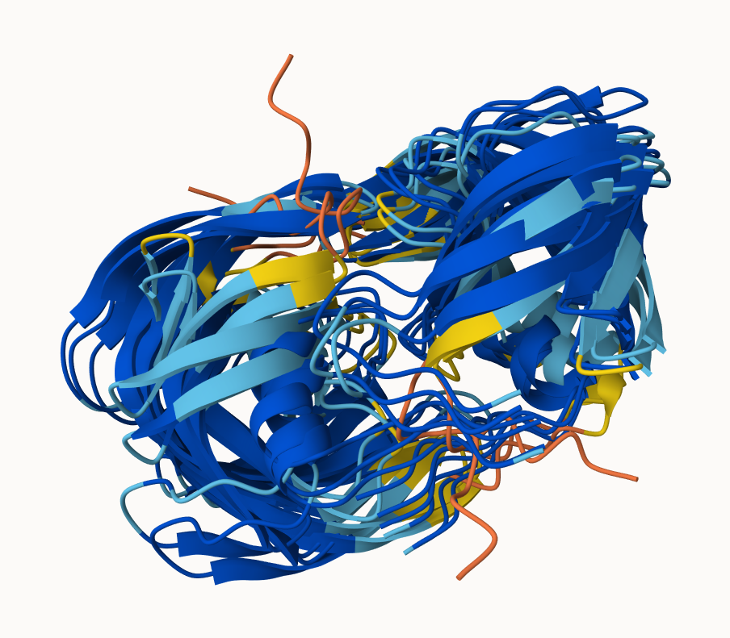
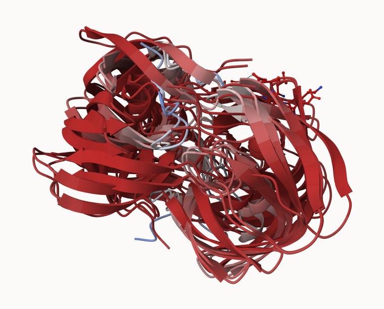
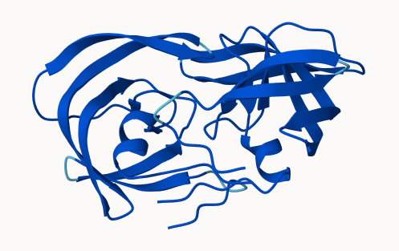

## Background

## EBI AlphaFold Databse

## Running AlphaFold

We can download and run locally on out own computer, but we need a GPU. Or we can use "cloud" computing to run this on someone elses computer :)

We use ColabFold : \< https://github.com/sokrypton/ColabFold \>

We previously found there was no AFDB entry for out HIV sequence

```         
>HIV-Pr
PQITLWQRPLVTIKIGGQLKEALLDTGADDTVLEEMSLPGRWKPKMIGGIGGFIKVRQYDQILIEICGHKAIGTVLVGPTPVNIIGRNLLTQIGCTLNF:PQITLWQRPLVTIKIGGQLKEALLDTGADDTVLEEMSLPGRWKPKMIGGIGGFIKVRQYDQILIEICGHKAIGTVLVGPTPVNIIGRNLLTQIGCTLNF
```

We will use: AlphaFold2_mmseqs2 - this is a search method (not as senstitive as hammer - recall hidden markov model) but mmseq2 is far faster and will generate results much more quickly even if it is not as deep of a search

The PDB databse (the main repository of experimental structures) only has \~250k structures (see last lab). The main sequence database has over **200 million** sequences!

so what's our coverage

```{r}
(250000/200000000) * 100
```

pretty bad :/ which is really low...ONLY 0.125% of known sequences have a known structure - this is the "structure gap" Structures are much harder to determine than sequences - they are expensive on average cost a million bucks ro even more!! they take an average of 3 to 5 years to solve !!

## EBI AlphaFold Database

The EBI has a adatabase of pre-computed AlphaFold (AF) models called AFDB. This is growing all the time and can be useful to check before running AF on our own

## Custom Analysis of Resulting Models

```{r}
results_dir <- "/Users/poojaparthasarathy/Documents/WINTER 2026 UCSD/BIMM143/r wrok/class11/HIVpr_23119"
```

```{r}
# Now we get all file names from the directory 

pdb_files <- list.files(path = results_dir, pattern = "*.pdb" , full.names = TRUE)

basename(pdb_files)

```


```{r}
# for us to pdb align the given pdb files  (runs a multiple seq alignmene)
library(bio3d)

pdbs <- pdbaln(pdb_files, fit = TRUE, exefile = "msa")

```

```{r}
pdbs
```

```{r}
#root mean square deviation 

rd <- rmsd(pdbs, fit=T)
range(rd)
```

```{r}
library(pheatmap)

colnames(rd) <- paste0("m",1:5)
rownames(rd) <- paste0("m",1:5)
pheatmap(rd)

```

```{r}
# Read a reference PDB structure
pdb <- read.pdb("1hsg")
```

```{r}
plotb3(pdbs$b[1,], typ="l", lwd=2, sse=pdb)
points(pdbs$b[2,], typ="l", col="red")
points(pdbs$b[3,], typ="l", col="blue")
points(pdbs$b[4,], typ="l", col="darkgreen")
points(pdbs$b[5,], typ="l", col="orange")
abline(v=100, col="gray")
```

```{r}
core <- core.find(pdbs)
```

```{r}
core.inds <- print(core, vol=0.5)
```

```{r}
xyz <- pdbfit(pdbs, core.inds, outpath="corefit_structures")
```



```{r}
rf <- rmsf(xyz)

plotb3(rf, sse=pdb)
abline(v=100, col="gray", ylab="RMSF")
```
## Predicted Alignment Error

```{r}
library(jsonlite)

pae_files <- list.files(path=results_dir,
                        pattern=".*model.*\\.json",
                        full.names = TRUE)
```

```{r}
pae1 <- read_json(pae_files[1],simplifyVector = TRUE)
pae5 <- read_json(pae_files[5],simplifyVector = TRUE)

attributes(pae1)
```

```{r}
# Per-residue pLDDT scores 
#  same as B-factor of PDB..
head(pae1$plddt) 
```

```{r}
pae1$max_pae
```

```{r}
pae5$max_pae
```

```{r}
plot.dmat(pae1$pae, 
          xlab="Residue Position (i)",
          ylab="Residue Position (j)")
```

```{r}
plot.dmat(pae5$pae, 
          xlab="Residue Position (i)",
          ylab="Residue Position (j)",
          grid.col = "black",
          zlim=c(0,30))
```

```{r}
#normalizing z range and we can see 1 performs far model 5

plot.dmat(pae1$pae, 
          xlab="Residue Position (i)",
          ylab="Residue Position (j)",
          grid.col = "black",
          zlim=c(0,30))
```
## Residue conservation from alignment file 

```{r}
aln_file <- list.files(path=results_dir,
                       pattern=".a3m$",
                        full.names = TRUE)
aln_file
```

```{r}
aln <- read.fasta(aln_file[1], to.upper = TRUE)
```

```{r}
dim(aln$ali)
```

```{r}
sim <- conserv(aln)
```

```{r}
plotb3(sim[1:99], sse=trim.pdb(pdb, chain="A"),
       ylab="Conservation Score")
```
```{r}
con <- consensus(aln, cutoff = 0.9)
con$seq
```

```{r}
m1.pdb <- read.pdb(pdb_files[1])
occ <- vec2resno(c(sim[1:99], sim[1:99]), m1.pdb$atom$resno)
write.pdb(m1.pdb, o=occ, file="m1_conserv.pdb")
```



